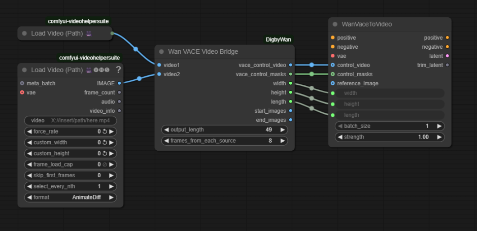
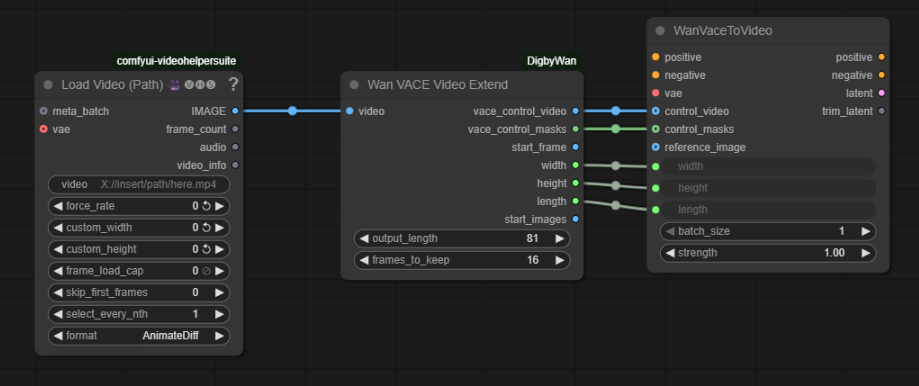
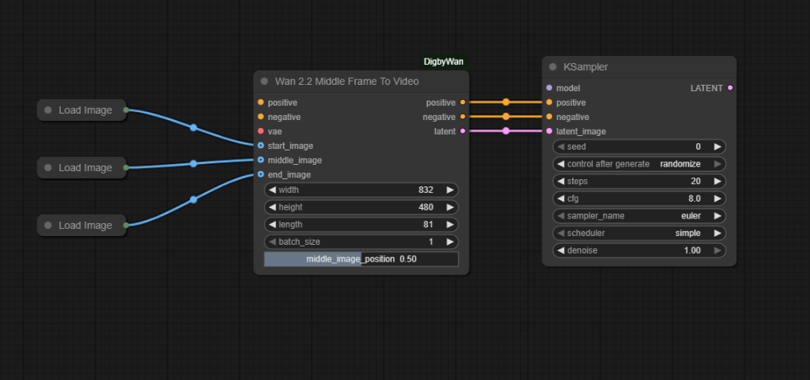
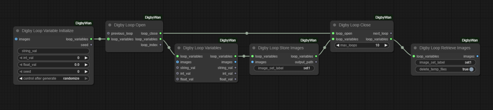
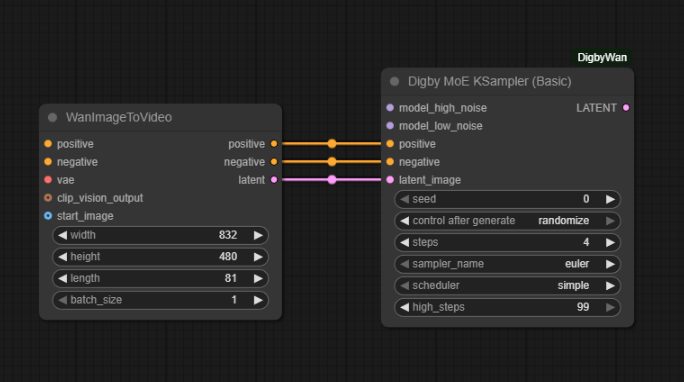

# ComfyUI-DigbyWan

This collection of nodes for ComfyUI is intended to provide simplified ways to use various Wan models, as well as basic looping nodes for making extended length videos.


**These nodes are a WIP.  Future changes may break things.**

* [Node List](#node-list)
* [Installation](#installation)
* [Node Descriptions](#node-descriptions)
* [Workflows](#workflows)
* [Credits](#credits)

## Node List

| Node Name | Description |
| --- | --- |
| [Wan VACE Video Smooth](#wan-vace-video-smooth) | Prepares VACE control_video to create a smooth transition between two videos, or within a single video at a specific frame.
| [Wan VACE Video Bridge](#wan-vace-video-bridge) | Prepares VACE control_video for generating new video that smoothly extends one video into another.
| [Wan VACE Video Extend](#wan-vace-video-extend) | Prepares VACE control_video for generating new video that continues smoothly from the end of a video.
| [Wan 2.2 Middle Frame To Video](#wan-22-middle-frame-to-video) | Implementation of FMLF2V for Wan 2.2.
|  |  |
 | [Digby Loop Open](#digby-loop) | A streamlined loop implementation. |
 | [Digby Loop Close](#digby-loop) | A stramlined loop implementation. |
 | [Digby Loop Variable Initialize](#digby-loop) | Loop variables for saving state through iterations. |
 | [Digby Loop Variables](#digby-loop) | Loop variables for saving state through iterations. |
 | [Digby Loop Store Images](#digby-loop) | Store images into temporary disk storage in loops. |
 | [Digby Loop Retrieve Images](#digby-loop) | Retrieve stored temporary images from disk. |
 | | |
 | [Digby MoE KSampler (Basic)](#digby-moe-ksampler) | Basic Moe (Mixture of Expert) KSampler with sane defaults for 4 step WAN and proper sigma steps  |
 | [Digby MoE KSampler](#digby-moe-ksampler) | Standard Moe (Mixture of Expert) KSampler with proper sigma steps |
 | | |
<!---
| [Image Batch Loop Extractor](#image-batch-loop-extractor) | Extracts the middle frames of a video.  Use case is for a looping video that has been smoothed with itself.
--->

## Installation

To install this node, simply clone this respoitory into your custom_nodes directory.  

```bash
cd /path/to/comfyui/custom_nodes
git clone https://github.com/JosDigby/ComfyUI-DigbyWan
```

## Node Descriptions

### Wan VACE Video Smooth

Generates the VACE control video and mask for a smooth transition in a video centered on a specific transition_frame, or between two videos.  The intended use is to render new frames to replace some of the frames of the original video(s) in order the make the new, smoother transition.


### Wan VACE Video Bridge

Generates the VACE control video and mask for create new frames that will create a transition between the end of *video1* and the start of *video2*.




### Wan VACE Video Extend

Generates the VACE control video and mask to create new frames that will continue smoothly from the end of the supplied *video*.




### Wan 2.2 Middle Frame To Video

This node allows for midle frame inclusion in Wan 2.2 video generation.  All the image slots are optional, With onle *start_image* and *end_image* connected, it behaves like the stock *WanFirstLastFrameToVideo* node.  For any inclusion of the *middle_image*, I have had the best results when the color grading matches closely.  In other cases, there can be some strobing and color flashing.  The slider  *middle_position* allows the *middle_image* to fall anywhere between the start and the end of the video.



### Digby Loop 

1. Digby Loop Open - Marks the starting point of the loop in the workflow.  Connect to a *Digby Loop Close* node.
2. Digby Loop Close - Marks the end of the loop from the connected *Digby Loop Open* node.
3. Digby Loop Variable Initialize - Set starting state data for a loop
4. Digby Loop Variables - Set/get state data inside a loop
5. Digby Loop Store Images - Write the given image batch to disk in a temporary directory with a given *set_label*.
6. Digby Loop Retrieve Images - Read images stored with a given *set_label* from the temporary directory.  



### Digby Moe KSampler



## Workflows

Workflow templates are provided and can be found in the ComfyUI Template list under ComfyUI-DigbyWan.


## Credits

These nodes use code and logic from:

* [stduhpf/ComfyUI-WanMoeKSampler](https://github.com/stduhpf/ComfyUI-WanMoeKSampler)
* [WainWong/ComfyUI-Loop-image](https://github.com/WainWong/ComfyUI-Loop-image)